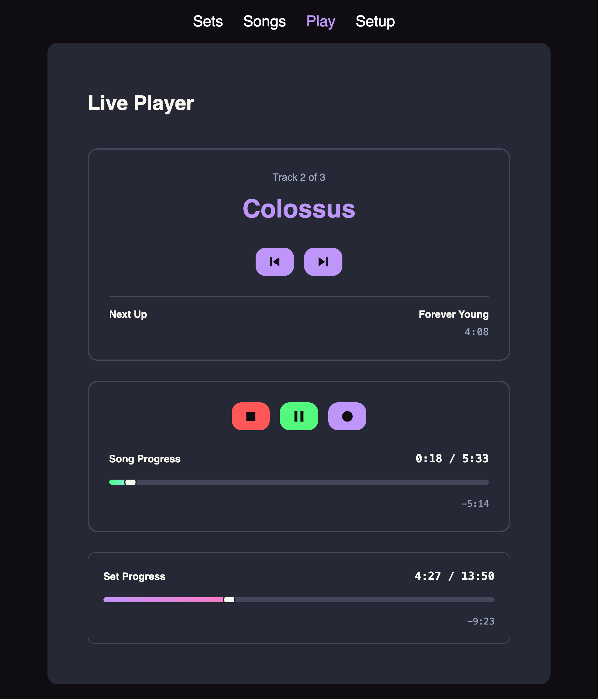
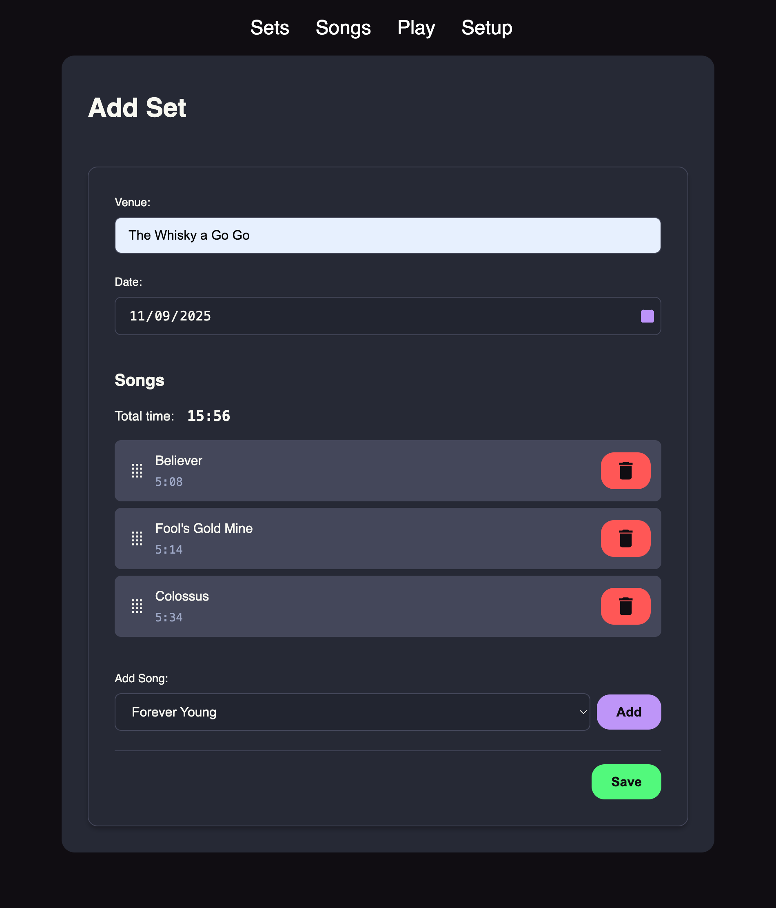

# Reaper Setlist

A simple setlist management script for the Reaper DAW.

## Features

- 🎵 Manage setlists and songs for Reaper
- 🎸 Control live shows from a web interface
- 📱 Use remotely from a mobile device

<- Video demo on YouTube

## Installation

### Via ReaPack

- Add the `https://raw.githubusercontent.com/iKadmium/reaper-setlist/refs/heads/main/reapack/repo/index.xml` repo to your repositories list.
- Install the Reaper Setlist package.
- Add a web interface to your Reaper settings if you haven't already.
- Open a web browser to the `/setlist.html` page in your Reaper web instance (default will be http://localhost:8080/setlist), and follow the instructions.

### Manual

- Download the package from the [releases section](https://github.com/iKadmium/reaper-setlist/releases) on the right.
- Extract it to your Reaper user resources folder. To find this, in Reaper, open the Options menu and click `Show REAPER resource path in Finder/Explorer...`
- Add a web interface to your Reaper settings if you haven't already.
- Open a web browser to the `/setlist.html` page in your Reaper web instance (default will be http://localhost:8080/setlist), and follow the instructions.

## Usage

Place your Reaper project song files in the folder you set up, and add songs and setlists.

## License

This project is licensed under the GNU General Public License v3.0 - see the [LICENSE](LICENSE) file for details.
